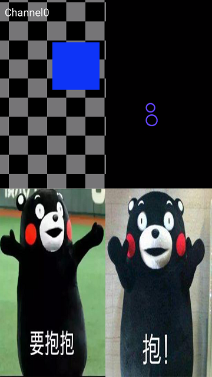
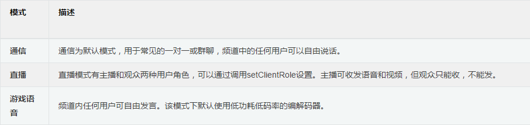
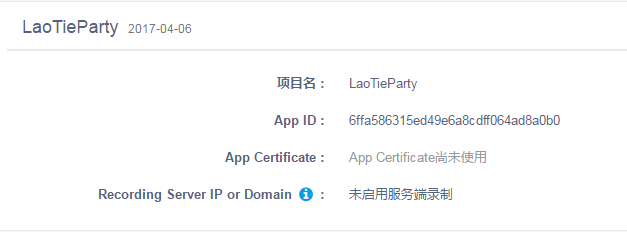
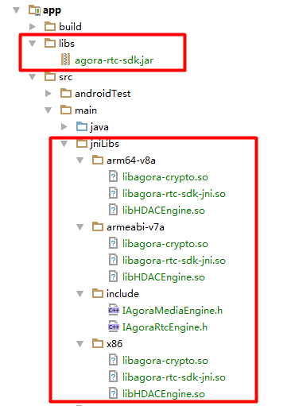
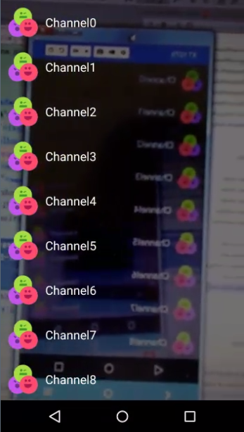
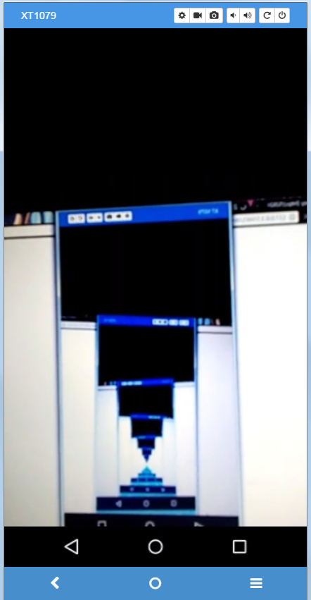
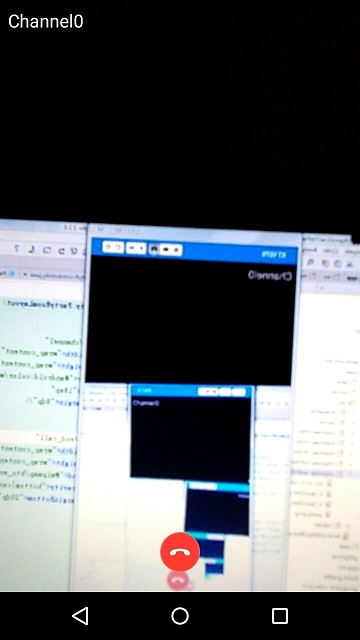
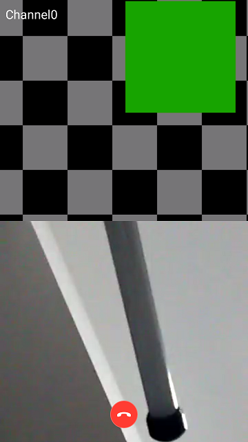
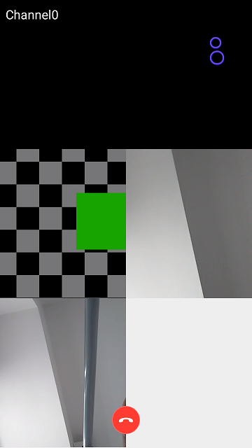

叔想做个直播demo很久了，最近终于得空，做了一个视频群聊Demo，以飨观众。 直播云有很多大厂在做，经老铁介绍，Agora不错，遂入坑。 Agora提供多种模式，一个频道可以设置一种模式, 切换方便：



# Agora SDK集成 #
叔专注SDK集成几十年，Agora SDK集成也并没有搞什么事情，大家按照下面步骤上车就行。

## 1. 注册 ##
登录[官网](https://www.agora.io/cn/)，注册个人账号，这个叔就不介绍了。

## 2. 创建应用 ##
注册账号登录后，进入后台，找到“添加新项目”按钮，点击创建新项目，创建好后就会获取到一个App ID, 做过SDK集成的老铁们都知道这是干啥用的。



## 3. 下载SDK ##
进入官方[下载](https://www.agora.io/cn/news/download/)界面, 这里我们选择```视频通话 + 直播 SDK```中的Android版本下载。下载后解压之后又两个文件夹，分别是libs和samples, libs文件夹存放的是库文件，samples是官方Demo源码，大叔曾说过欲练此SDK，必先跑Sample, 有兴趣的同学可以跑跑。

## 4. 集成SDK ##
### 1. 导入库文件 ###
将libs文件夹的下的文件导入Android Studio, 最终效果如下：



### 2. 添加必要权限 ###
在AndroidManifest.xml中添加如下权限

    <uses-permission android:name="android.permission.INTERNET" />
    <uses-permission android:name="android.permission.RECORD_AUDIO" />
    <uses-permission android:name="android.permission.ACCESS_NETWORK_STATE" />
    <uses-permission android:name="android.permission.CAMERA" />

### 3. 配置APP ID ###
在values文件夹下创建strings-config.xml, 配置在官网创建应用的App ID。

	<resources>
	    <string name="private_app_id">6ffa586315ed49e6a8cdff064ad8a0b0</string>
	</resources>

# 小结 #
至此，Agoria SDK集成已经完毕，似不似如丝般顺滑？如果官方能够提供Gradle依赖，还可以省掉下载SDK和导入库文件的步骤，那就更滑了。接下来我们就可以愉快地和SDK玩耍了。

# Agoria SDK实践 #
## 主界面（MainActivity）##


在主界面，我们需要检查先Camera和Audio权限，以适配Andriod6.0及以上版本。

    private static final int PERMISSION_REQ_ID_RECORD_AUDIO = 0;
    private static final int PERMISSION_REQ_ID_CAMERA = 1;

    @Override
    protected void onCreate(Bundle savedInstanceState) {
        super.onCreate(savedInstanceState);
        setContentView(R.layout.activity_main);
		//检查Audio权限
        if (checkSelfPermission(Manifest.permission.RECORD_AUDIO, PERMISSION_REQ_ID_RECORD_AUDIO)) {
			//检查Camera权限
            checkSelfPermission(Manifest.permission.CAMERA, PERMISSION_REQ_ID_CAMERA);
        }
    }

    public boolean checkSelfPermission(String permission, int requestCode) {
        if (ContextCompat.checkSelfPermission(this, permission) != PackageManager.PERMISSION_GRANTED) {
            ActivityCompat.requestPermissions(this, new String[]{permission}, requestCode);
            return false;
        }
        return true;
    }

## 频道界面 (ChannelActivity) ##
点击```开PA!```，进入频道选择界面



### 创建频道列表 ###
这里使用RecyclerView创建频道列表。

    /**
     * 初始化频道列表
     */
    private void initRecyclerView() {
        mRecyclerView = (RecyclerView) findViewById(R.id.recycler_view);
        mRecyclerView.setHasFixedSize(true);
        mRecyclerView.setLayoutManager(new LinearLayoutManager(this));
        mRecyclerView.setAdapter(new ChannelAdapter(this, mockChannelList()));
    }

### 前置摄像头预览 ##
频道界面背景为前置摄像头预览，这个可以使用Android SDK自己实现。但Agora SDK提供了相关API可以直接实现前置摄像头预览的功能。具体实现如下：

#### 1. 初始化RtcEngine ####
RtcEngine是Agora SDK的核心类，叔用一个管理类AgoraManager进行了简单的封装，提供操作RtcEngine的核心功能。
初始化如下：

    /**
     * 初始化RtcEngine
     */
    public void init(Context context) {
        //创建RtcEngine对象， mRtcEventHandler为RtcEngine的回调
        mRtcEngine = RtcEngine.create(context, context.getString(R.string.private_app_id), mRtcEventHandler);
        //开启视频功能
        mRtcEngine.enableVideo();
        //视频配置，设置为360P
        mRtcEngine.setVideoProfile(Constants.VIDEO_PROFILE_360P, false);
        mRtcEngine.setChannelProfile(Constants.CHANNEL_PROFILE_COMMUNICATION);//设置为通信模式（默认）
        //mRtcEngine.setChannelProfile(Constants.CHANNEL_PROFILE_LIVE_BROADCASTING);设置为直播模式
        //mRtcEngine.setChannelProfile(Constants.CHANNEL_PROFILE_GAME);设置为游戏模式
    }


	/**
	 * 在Application类中初始化RtcEngine，注意在AndroidManifest.xml中配置下Application
	 */
	public class LaoTieApplication extends Application {
	
	    @Override
	    public void onCreate() {
	        super.onCreate();
	        AgoraManager.getInstance().init(getApplicationContext());
	    }
	}

#### 2. 设置本地视频 ####

    /**
     * 设置本地视频，即前置摄像头预览
     */
    public AgoraManager setupLocalVideo(Context context) {
        //创建一个SurfaceView用作视频预览
        SurfaceView surfaceView = RtcEngine.CreateRendererView(context);
        //将SurfaceView保存起来在SparseArray中，后续会将其加入界面。key为视频的用户id，这里是本地视频, 默认id是0
        mSurfaceViews.put(mLocalUid, surfaceView);
        //设置本地视频，渲染模式选择VideoCanvas.RENDER_MODE_HIDDEN，如果选其他模式会出现视频不会填充满整个SurfaceView的情况，
        //具体渲染模式的区别是什么，官方也没有详细的说明
        mRtcEngine.setupLocalVideo(new VideoCanvas(surfaceView, VideoCanvas.RENDER_MODE_HIDDEN, mLocalUid));
        return this;//返回AgoraManager以作链式调用
    }

#### 3. 添加SurfaceView到布局 ####
    @Override
    protected void onResume() {
        super.onResume();
        //先清空容器
        mFrameLayout.removeAllViews();
        //设置本地前置摄像头预览并启动
        AgoraManager.getInstance().setupLocalVideo(getApplicationContext()).startPreview();
        //将本地摄像头预览的SurfaceView添加到容器中
        mFrameLayout.addView(AgoraManager.getInstance().getLocalSurfaceView());
    }
#### 4. 停止预览 ####
    /**
     * 停止预览
     */
    @Override
    protected void onPause() {
        super.onPause();
        AgoraManager.getInstance().stopPreview();
    }

## 聊天室 (PartyRoomActivity) ##
点击频道列表中的选项，跳转到聊天室界面。聊天室界面显示规则是：1个人是全屏，2个人是2分屏，3-4个人是4分屏，5-6个人是6分屏， 4分屏和6分屏模式下，双击一个小窗，窗会变大，其余小窗在底部排列。最多支持六人同时聊天。基于这种需求，叔决定写一个自定义控件PartyRoomLayout来完成。PartyRoomLayout直接继承ViewGroup，根据不同的显示模式来完成孩子的测量和布局。

### 1人全屏 ###


1人全屏其实就是前置摄像头预览效果。

#### 前置摄像头预览 ####

    //设置前置摄像头预览并开启
    AgoraManager.getInstance()
            .setupLocalVideo(getApplicationContext())
            .startPreview();
    //将摄像头预览的SurfaceView加入PartyRoomLayout
    mPartyRoomLayout.addView(AgoraManager.getInstance().getLocalSurfaceView());

#### PartyRoomLayout处理1人全屏 ####

    /**
     * 测量一个孩子的情况，孩子的宽高和父容器即PartyRoomLayout一样
     */
    private void measureOneChild(int widthMeasureSpec, int heightMeasureSpec) {
        View child = getChildAt(0);
        child.measure(widthMeasureSpec, heightMeasureSpec);
    }

    /**
     * 布局一个孩子的情况
     */
    private void layoutOneChild() {
        View child = getChildAt(0);
        child.layout(0, 0, child.getMeasuredWidth(), child.getMeasuredHeight());
    }

#### 加入频道 ####

从频道列表跳转过来后，需要加入到用户所选的频道。

    //更新频道的TextView
    mChannel = (TextView) findViewById(R.id.channel);
    String channel = getIntent().getStringExtra(“Channel”);
    mChannel.setText(channel);

	//在AgoraManager中封装了加入频道的API
	AgoraManager.getInstance()
                .setupLocalVideo(getApplicationContext())
                .joinChannel(channel)//加入频道
                .startPreview();

#### 挂断 ####



当用户点击挂断按钮可以退出频道

    mEndCall = (ImageButton) findViewById(R.id.end_call);
    mEndCall.setOnClickListener(new View.OnClickListener() {
        @Override
        public void onClick(View v) {
            //AgoraManager里面封装了挂断的API, 退出频道
            AgoraManager.getInstance().leaveChannel();
            finish();
        }
    });

### 二分屏 ###

#### 事件监听器 ####
IRtcEngineEventHandler类里面封装了Agora SDK里面的很多事件回调，在AgoraManager中我们创建了IRtcEngineEventHandler的一个对象mRtcEventHandler，并在创建RtcEngine时传入。

    private IRtcEngineEventHandler mRtcEventHandler = new IRtcEngineEventHandler() {

        /**
         * 当获取用户uid的远程视频的回调
         */
        @Override
        public void onFirstRemoteVideoDecoded(int uid, int width, int height, int elapsed) {
            if (mOnPartyListener != null) {
                mOnPartyListener.onGetRemoteVideo(uid);
            }
        }

        /**
         * 加入频道成功的回调
         */
        @Override
        public void onJoinChannelSuccess(String channel, int uid, int elapsed) {
            if (mOnPartyListener != null) {
                mOnPartyListener.onJoinChannelSuccess(channel, uid);
            }
        }

        /**
         * 退出频道
         */
        @Override
        public void onLeaveChannel(RtcStats stats) {
            if (mOnPartyListener != null) {
                mOnPartyListener.onLeaveChannelSuccess();
            }
        }

        /**
         * 用户uid离线时的回调
         */
        @Override
        public void onUserOffline(int uid, int reason) {
            if (mOnPartyListener != null) {
                mOnPartyListener.onUserOffline(uid);
            }
        }
    };

同时，我们也提供了一个接口，暴露给AgoraManager外部。

    public interface OnPartyListener {

        void onJoinChannelSuccess(String channel, int uid);

        void onGetRemoteVideo(int uid);

        void onLeaveChannelSuccess();

        void onUserOffline(int uid);
    }

在PartyRoomActivity中监听事件

    AgoraManager.getInstance()
            .setupLocalVideo(getApplicationContext())
            .setOnPartyListener(mOnPartyListener)//设置监听
            .joinChannel(channel)
            .startPreview();

#### 设置远程用户视频 ####


    private AgoraManager.OnPartyListener mOnPartyListener = new AgoraManager.OnPartyListener() {

        /**
         * 获取远程用户视频的回调
         */
        @Override
        public void onGetRemoteVideo(final int uid) {
			//操作UI，需要切换到主线程
            runOnUiThread(new Runnable() {
                @Override
                public void run() {
                    //设置远程用户的视频
                    AgoraManager.getInstance().setupRemoteVideo(PartyRoomActivity.this, uid);
                    //将远程用户视频的SurfaceView添加到PartyRoomLayout中，这会触发PartyRoomLayout重新走一遍绘制流程
                    mPartyRoomLayout.addView(AgoraManager.getInstance().getSurfaceView(uid));
                }
            });
        }

    };

#### 测量布局二分屏 ####
当第一次回调onGetRemoteVideo时，说明现在有两个用户了，所以在PartyRoomLayout中需要对二分屏模式进行处理

    /**
     * 二分屏时的测量
     */
    private void measureTwoChild(int widthMeasureSpec, int heightMeasureSpec) {
        for (int i = 0; i < getChildCount(); i++) {
            View child = getChildAt(i);
            int size = MeasureSpec.getSize(heightMeasureSpec);
            //孩子高度为父容器高度的一半
            int childHeightMeasureSpec = MeasureSpec.makeMeasureSpec(size / 2, MeasureSpec.EXACTLY);
            child.measure(widthMeasureSpec, childHeightMeasureSpec);
        }
    }

    /**
     * 二分屏模式的布局
     */
    private void layoutTwoChild() {
        int left = 0;
        int top = 0;
        int right = getMeasuredWidth();
        int bottom = getChildAt(0).getMeasuredHeight();
        for (int i = 0; i < getChildCount(); i++) {
            View child = getChildAt(i);
            child.layout(left, top, right, bottom);
            top += child.getMeasuredHeight();
            bottom += child.getMeasuredHeight();
        }
    }


#### 用户离线时的处理 ####
当有用户离线时，我们需要移除该用户视频对应的SurfaceView

    private AgoraManager.OnPartyListener mOnPartyListener = new AgoraManager.OnPartyListener() {

        @Override
        public void onUserOffline(final int uid) {
            runOnUiThread(new Runnable() {
                @Override
                public void run() {
                    //从PartyRoomLayout移除远程视频的SurfaceView
                    mPartyRoomLayout.removeView(AgoraManager.getInstance().getSurfaceView(uid));
                    //清除缓存的SurfaceView
                    AgoraManager.getInstance().removeSurfaceView(uid);
                }
            });
        }
    };


### 四分屏和六分屏 ###
当有3个或者4个老铁开趴，界面显示成四分屏, 当有5个或者6个老铁开趴，界面切分成六分屏



由于之前已经处理了新进用户就会创建SurfaceView加入PartyRoomLayout的逻辑，所以这里只需要处理四六分屏时的测量和布局

#### 四六分屏测量 ####

    private void measureMoreChildSplit(int widthMeasureSpec, int heightMeasureSpec) {
        //列数为两列，计算行数
        int row = getChildCount() / 2;
        if (getChildCount() % 2 != 0) {
            row = row + 1;
        }
		//根据行数平分高度
        int childHeight = MeasureSpec.getSize(heightMeasureSpec) / row;
		//宽度为父容器PartyRoomLayout的宽度一般，即屏宽的一半
        int childWidth = MeasureSpec.getSize(widthMeasureSpec) / 2;
        for (int i = 0; i < getChildCount(); i++) {
            View child = getChildAt(i);
            int childHeightMeasureSpec = MeasureSpec.makeMeasureSpec(childHeight, MeasureSpec.EXACTLY);
            int childWidthMeasureSpec = MeasureSpec.makeMeasureSpec(childWidth, MeasureSpec.EXACTLY);
            child.measure(childWidthMeasureSpec, childHeightMeasureSpec);
        }
    }

#### 四六分屏布局 ####
    private void layoutMoreChildSplit() {
        int left = 0;
        int top = 0;
        for (int i = 0; i < getChildCount(); i++) {
            View child = getChildAt(i);
            int right = left + child.getMeasuredWidth();
            int bottom = top + child.getMeasuredHeight();
            child.layout(left, top, right, bottom);
            if ( (i + 1 )% 2 == 0) {//满足换行条件，更新left和top，布局下一行
                left = 0;
                top += child.getMeasuredHeight();
            } else {
                //不满足换行条件，更新left值，继续布局一行中的下一个孩子
                left += child.getMeasuredWidth();
            }
        }
    }


